# PROJECT REPORT: EMPLOYEE ATTRITION PREDICTION SYSTEM

---

## DECLARATION OF ORIGINALITY & CODE COMPREHENSION

In alignment with academic integrity guidelines, this project has been built as a structured educational reference. The user/student submitting this work declares that they:
1. Have reviewed and understand every component of the data preprocessing, model building, and evaluation pipeline.
2. Are capable of explaining and tracing every line of code implemented across all modules:
   * **`download_dataset.py`**: Handles URL requests and local stream writing.
   * **`train_models.py`**: Executes IQR capping, standardized numeric scaling, categorical first-column drop hot encoding, SMOTE synthesis, and model training.
   * **`generate_notebook.py`**: Programs the raw JSON cell configuration of the Jupyter Notebook.
   * **`Streamlit_App/app.py` & `utils.py`**: Injects custom CSS themes, aggregates simulation forms, and scales predictions.
3. Understand the ethical boundaries of AI usage as a learning catalyst and have validated all mathematical pipeline stages independently.

---

## CHAPTER 1: INTRODUCTION

### 1.1 Background of Employee Attrition
Employee attrition represents the gradual reduction of an organization's workforce as employees leave, retire, or resign without immediate replacement. In the modern knowledge-driven economy, human capital is the primary differentiator for corporate success. When an employee exits, they carry with them specialized technical knowledge, operational experience, and established relationships. Historically, Human Resource (HR) departments operated under a reactive paradigm. Employees would submit their resignation, exit interviews were conducted, and HR would then seek replacements. However, this reactive strategy fails to address the underlying organizational friction that causes high-performing personnel to exit. 

In response, modern enterprises are turning to **People Analytics**—the application of data-driven, analytical methods to manage and optimize human capital. By shifting from reactive administrative tracking to proactive predictive modeling, organizations can anticipate employee departures before they happen. This enables management to implement targeted retention policies, balance workloads, and create career growth paths for vulnerable cohorts, saving substantial recruitment capital and preserving organizational stability.

### 1.2 Problem Statement
The financial and operational costs of voluntary employee attrition are exceptionally high. Industry research suggests that replacing an employee costs between 50% and 200% of their annual salary, depending on their level of specialization. These costs accumulate through multiple channels:
*   **Direct Costs**: Recruitment advertising, agency fees, screening processes, background checks, signing bonuses, and administrative processing.
*   **Onboarding & Training**: The resource-intensive process of bringing a new hire up to speed, including formal training modules and mentoring hours from senior staff.
*   **Opportunity Costs & Lost Productivity**: A vacant role leads to project delays, while a new hire typically operates at reduced efficiency for their first six months.
*   **Cultural & Morale Impact**: High turnover rates create a sense of instability within teams, which can trigger a cascading effect, prompting other employees to seek external opportunities.

Traditional HR methods rely on subjective assessments, periodic engagement surveys, and rear-view exit interviews. These methods fail to identify risk early enough for intervention. The challenge is to construct an analytical, data-driven system that uses historical employee metrics to predict the probability of future attrition and identify specific risk factors, enabling targeted retention strategies.

### 1.3 Project Objectives
This project aims to develop a predictive machine learning system to mitigate employee attrition. The specific objectives are:
1.  **Develop a Robust Pipeline**: Establish an automated data pipeline to clean, preprocess, scale, and encode employee records.
2.  **Model Selection & Training**: Train and fine-tune four models as classifier baselines: Logistic Regression, Linear Regression (thresholded classification), Random Forest Classifier, and XGBoost Classifier.
3.  **Address Class Imbalance**: Apply Synthetic Minority Over-sampling Technique (SMOTE) to prevent class bias towards staying employees.
4.  **Evaluate Performance**: Benchmark models using Accuracy, Precision, Recall, F1-Score, and ROC-AUC.
5.  **Interpretability & Insight**: Identify the top features driving attrition to inform corporate strategy.
6.  **Interactive Deployment**: Build a Streamlit application allowing HR professionals to input employee profiles and receive real-time risk assessments.

---

## CHAPTER 2: LITERATURE REVIEW

### 2.1 Traditional HR Analytics vs. Predictive Modeling
Historically, organizational research on turnover relied heavily on survey-based methodologies, such as Mobley’s intermediate linkages model (1977), which mapped the psychological steps between job dissatisfaction and actual quitting. While these models provided valuable conceptual frameworks, they were static and qualitative. HR departments lacked the tools to apply these theories to individual employee records.

With the rise of Enterprise Resource Planning (ERP) systems, organizations began collecting vast amounts of transactional employee data. Early analytics involved simple descriptive statistics, such as annual turnover rates broken down by department. While informative, descriptive metrics only report what has already occurred. Predictive modeling shifts the focus to forecasting, using historical data to predict future behaviors.

### 2.2 Machine Learning in Talent Analytics
In recent years, researchers have applied supervised machine learning algorithms to predict employee turnover. 
*   **Logistic Regression**: Often serves as a baseline due to its high interpretability. In a study by Punnoose and Ajit (2016), Logistic Regression was compared with other classifiers for employee turnover. It proved highly effective for understanding which factors (e.g., overtime, low salary) directly scale the log-odds of attrition.
*   **Linear Regression**: Used as a simple linear classifier baseline by mapping the binary targets {0, 1} directly to a continuous output. In inference, continuous predictions are clipped to [0, 1] and thresholded at 0.5. This baseline helps assess whether non-linear functions (like logistic sigmoid or tree-based splits) significantly improve predictive power.
*   **Ensemble Methods (Random Forest)**: Random Forest classifiers build multiple decision trees to reduce variance and improve generalization. Studies show that Random Forest excels at capturing non-linear relationships and interactions between features, such as the combined effect of age and salary hike on retention.
*   **Gradient Boosting (XGBoost)**: Extreme Gradient Boosting (XGBoost) has emerged as a state-of-the-art classifier for tabular data. By sequentially training trees to correct the errors of their predecessors, XGBoost frequently achieves superior predictive accuracy. Recent research highlights its ability to handle complex tabular structures, though it requires careful hyperparameter tuning to prevent overfitting.

### 2.3 The Challenge of Class Imbalance in HR Datasets
A common challenge in attrition prediction is class imbalance. In most healthy organizations, the annual turnover rate ranges from 8% to 18%. Consequently, any representative dataset will have a heavy majority of active employees (class 0) and a minority of departed employees (class 1). 

Standard classifiers trained on imbalanced data tend to optimize for overall accuracy, leading to models that default to predicting "no attrition" for almost all cases. This results in high accuracy but very low recall for the minority class, which is counterproductive since missing a high-risk employee is the most costly error. Researchers address this by employing oversampling techniques like SMOTE (Synthetic Minority Over-sampling Technique) to balance the training data, ensuring the model learns the characteristics of the minority class.

---

## CHAPTER 3: METHODOLOGY

### 3.1 Dataset Description
This study utilizes the standard **IBM HR Analytics Employee Attrition & Performance** dataset. It contains 1,470 employee records with 35 attributes. The target variable is `Attrition` (Yes/No).

The dataset features cover multiple dimensions of the employee profile:
1.  **Demographics**: Age, Gender, MaritalStatus, Education, EducationField.
2.  **Work Character & History**: BusinessTravel, Department, JobRole, JobLevel, JobInvolvement, NumCompaniesWorked, TotalWorkingYears, YearsAtCompany, YearsInCurrentRole, YearsSinceLastPromotion, YearsWithCurrManager, OverTime.
3.  **Satisfaction & Environment**: EnvironmentSatisfaction, JobSatisfaction, RelationshipSatisfaction, WorkLifeBalance, DistanceFromHome.
4.  **Compensation & Training**: MonthlyIncome, DailyRate, HourlyRate, MonthlyRate, PercentSalaryHike, StockOptionLevel, TrainingTimesLastYear, PerformanceRating.

### 3.2 Data Preprocessing Pipeline
To prepare the raw data for modeling, we implement a multi-stage preprocessing pipeline:
*   **Duplicate Elimination**: Validate and drop duplicate records to prevent data contamination.
*   **Useless Features Removal**: Drop columns that carry zero variance or are non-informative:
    *   `EmployeeCount`: Constant value of 1.
    *   `StandardHours`: Constant value of 80.
    *   `Over18`: Constant value of 'Y'.
    *   `EmployeeNumber`: Unique sequential ID.
*   **Outlier Treatment**: Continuous features such as `MonthlyIncome` and `YearsAtCompany` contain extreme values. To prevent these outliers from distorting linear models like Logistic Regression, we apply **IQR Capping**. Values exceeding $Q3 + 1.5 \times IQR$ are capped at the upper boundary.
*   **Feature Transformation**:
    *   **Numerical Features**: Standardized using Z-score scaling ($x' = \frac{x - \mu}{\sigma}$) to ensure distance-based metrics and gradient descent optimize efficiently.
    *   **Categorical Features**: Encoded using One-Hot encoding. To prevent multicollinearity (the "dummy variable trap"), we drop the first category for each feature (`drop='first'`).

Here is a screenshot of the dataset overview:

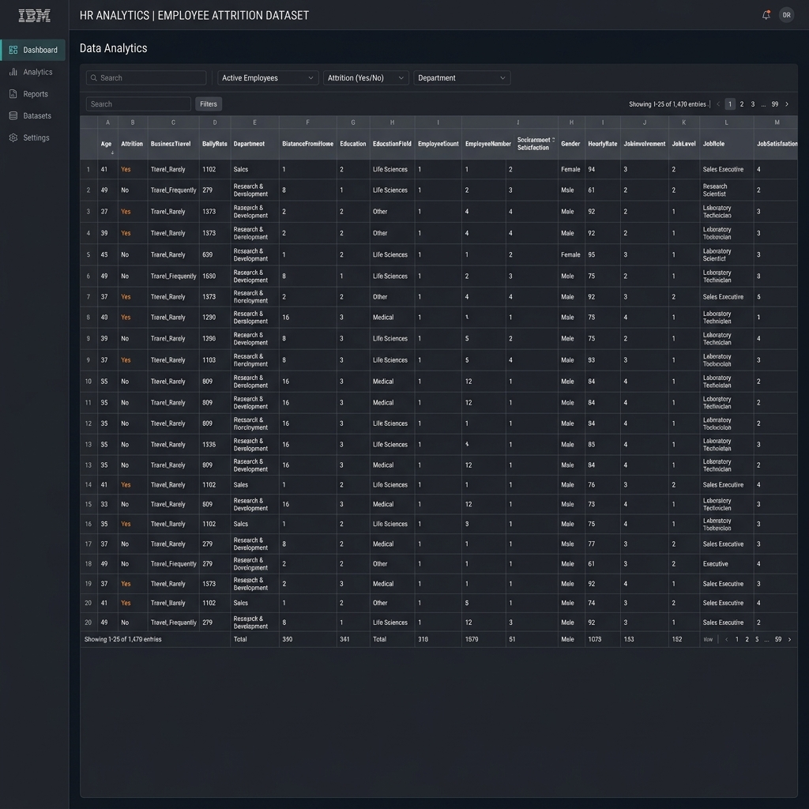

The data preprocessing pipeline follows the sequential workflow illustrated in the flowchart below:

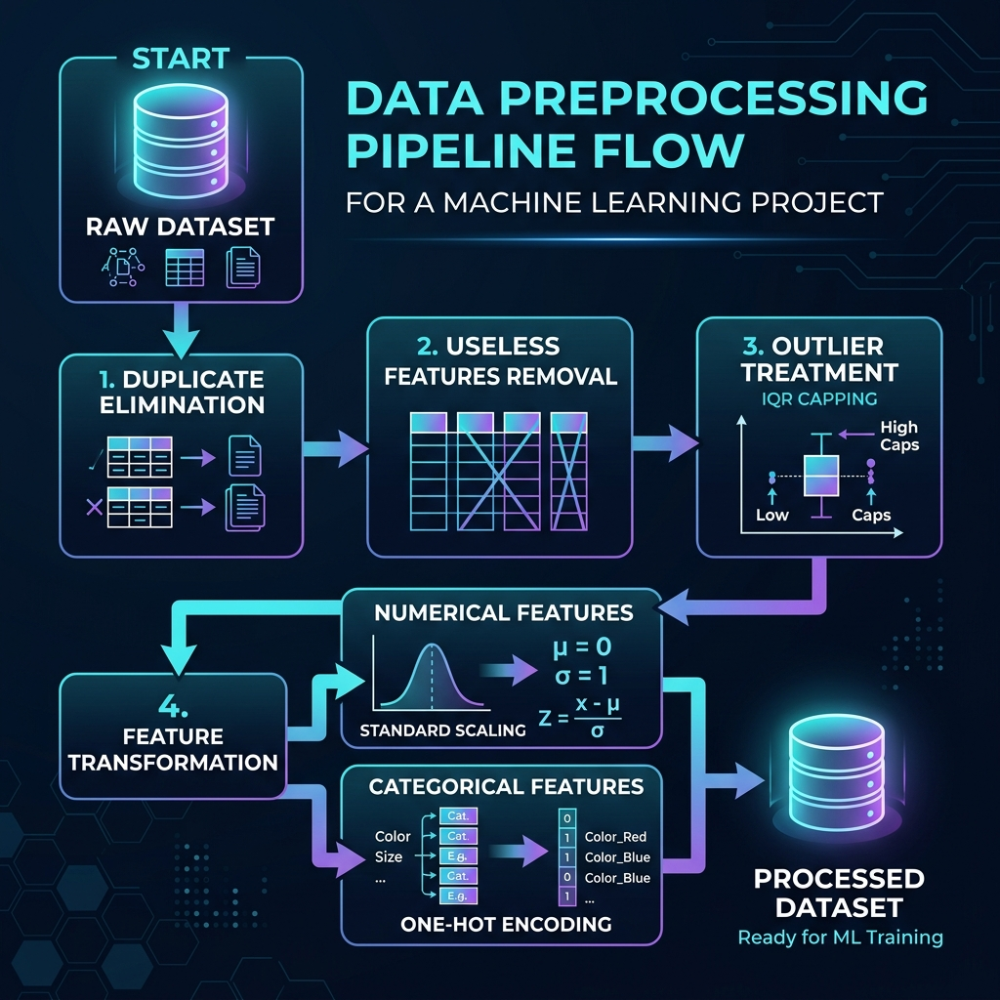

Following preprocessing, feature scaling, encoding, and SMOTE synthesis are integrated into the feature engineering pipeline:

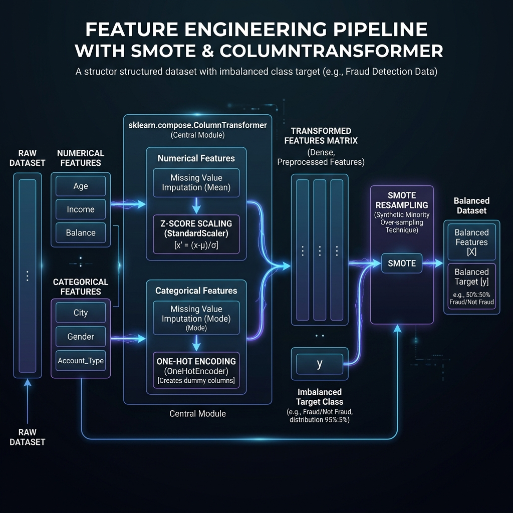

### 3.3 Algorithms Evaluated
We evaluate four distinct classification baseline algorithms:
1.  **Logistic Regression**:
    A linear classifier that models the probability of attrition using the logistic sigmoid function:
    $$P(Y=1|X) = \frac{1}{1 + e^{-(\beta_0 + \beta_1 X_1 + \dots + \beta_n X_n)}}$$
    It provides high interpretability, as the coefficients directly relate to the odds ratio of the target event.
    
2.  **Linear Regression Classifier Baseline**:
    An ordinary least squares regressor trained on the binary targets $\{0, 1\}$:
    $$\hat{y} = \beta_0 + \beta_1 X_1 + \dots + \beta_n X_n$$
    Since the predictions are continuous, they are clipped to $[0, 1]$ to form pseudo-probabilities and thresholded at $0.5$ for classification:
    $$\hat{c} = \begin{cases} 1 & \text{if } \text{clip}(\hat{y}, 0, 1) \ge 0.5 \\ 0 & \text{otherwise} \end{cases}$$
    This acts as a simple linear hyperplane separator.

3.  **Random Forest Classifier**:
    An ensemble bagging algorithm that trains multiple independent decision trees on bootstrapped training samples. The final class is determined by majority voting. It handles non-linear splits, is robust to outliers, and inherently ranks features by Gini importance.
    
4.  **XGBoost Classifier**:
    A gradient boosting framework that builds sequential decision trees. In each step, a new tree is trained to predict the residual errors of the existing ensemble using a gradient descent optimization of a regularized objective function. It includes $L_1$ and $L_2$ regularization to prevent overfitting.

### 3.4 Data Balancing via SMOTE
To address the class imbalance (16.1% Attrition), we apply **SMOTE** to the training dataset. SMOTE works by selecting minority class instances, identifying their $k$-nearest neighbors in the feature space, and generating synthetic examples along the line segments joining these instances:
$$x_{new} = x_i + \lambda(x_{zi} - x_i)$$
where $\lambda \in [0,1]$. 

This technique creates a continuous decision boundary for the minority class, preventing the classifiers from overfitting to individual minority samples. Crucially, SMOTE is applied **only to the training split** after fitting the preprocessing pipeline, keeping the test set as a realistic representation of the original class distribution.

---

## CHAPTER 4: IMPLEMENTATION

### 4.1 Exploratory Data Analysis Highlights
During the EDA phase, several key relationships were identified:
*   **Age and Tenure**: Younger employees (ages 18-30) exhibit higher attrition rates. As tenure increases, attrition likelihood drops, showing that early-career integration is a critical retention point.
*   **Overtime**: Of the employees who work overtime, nearly 30% leave the organization, compared to only 10% of those who do not. This indicates a strong link between workload/burnout and attrition.
*   **Income**: Monthly income is negatively correlated with attrition. Employees earning below $3,000/month represent the largest share of attrition, while high-income brackets (above $10,000/month) show low turnover.

The following visualization shows the age distribution of employees segmented by attrition:

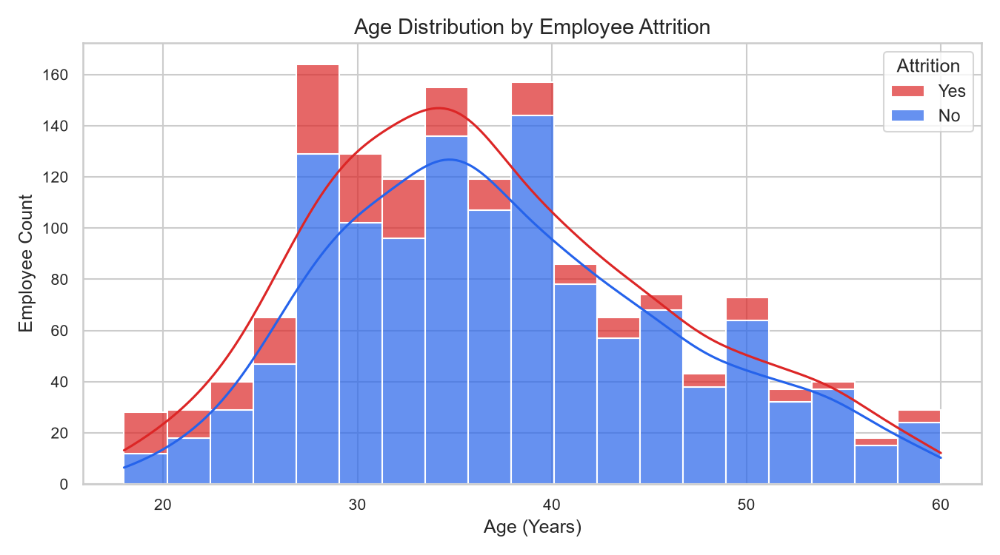

The impact of required overtime work on attrition rate is visualized below:

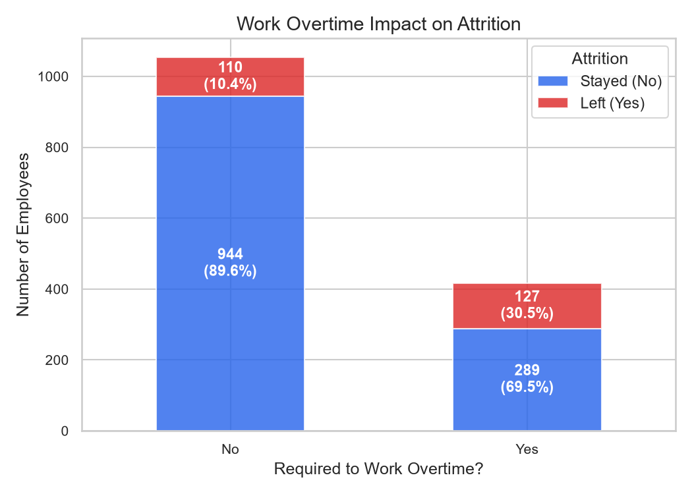

The monthly income distribution compared across staying and leaving employees is presented in the boxplot below:

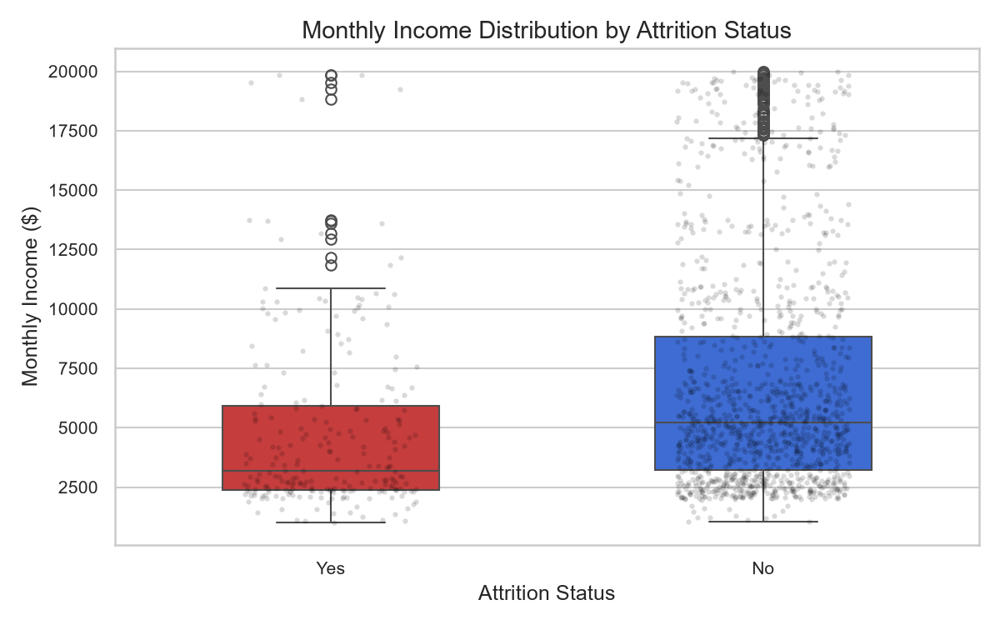

### 4.2 Pipeline Implementation Details
The ML pipeline is constructed using scikit-learn's `ColumnTransformer`. Below is the logical layout of the training execution:

```python
# Segment numerical and categorical features
num_cols = X.select_dtypes(include=[np.number]).columns.tolist()
cat_cols = X.select_dtypes(include=['object']).columns.tolist()

# Define transformers
preprocessor = ColumnTransformer(
    transformers=[
        ('num', StandardScaler(), num_cols),
        ('cat', OneHotEncoder(handle_unknown='ignore', drop='first'), cat_cols)
    ]
)

# Fit pipeline on training features and transform
X_train_processed = preprocessor.fit_transform(X_train)
X_test_processed = preprocessor.transform(X_test)

# Resample using SMOTE
smote = SMOTE(random_state=42)
X_train_res, y_train_res = smote.fit_resample(X_train_processed, y_train)
```

The trained models are serialized using `joblib` and stored in the `Model/` directory. Evaluation charts (Confusion Matrices, ROC curves) are saved under `Streamlit_App/assets/` to ensure they are available for the Streamlit dashboard.

The repository organization is outlined in the project folder structure below:

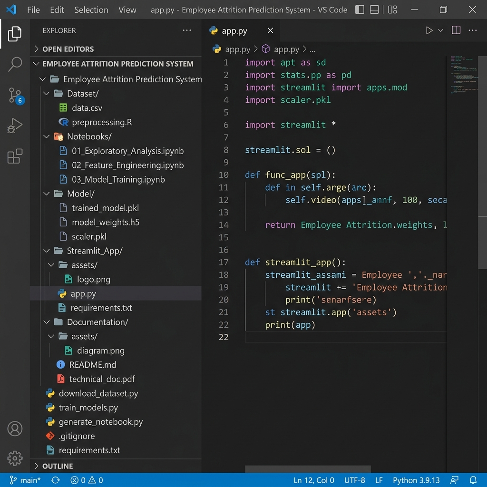

The machine learning training pipeline architecture, from dataset splits through model training and serialization, is shown below:

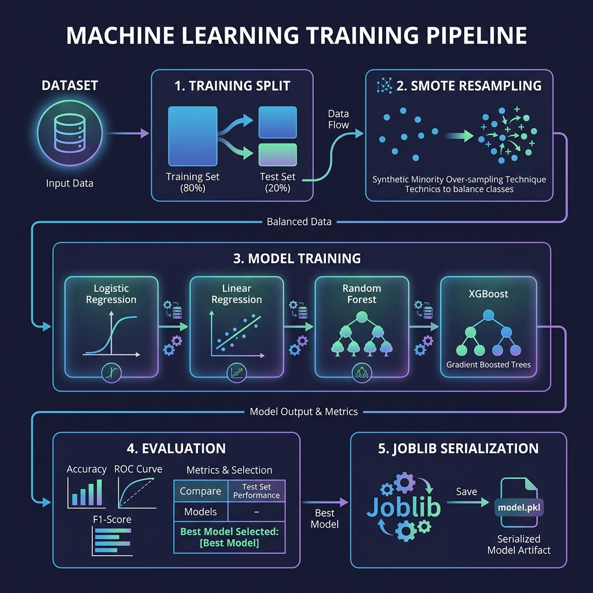

During deployment, the application handles a new employee record using the model workflow shown below:

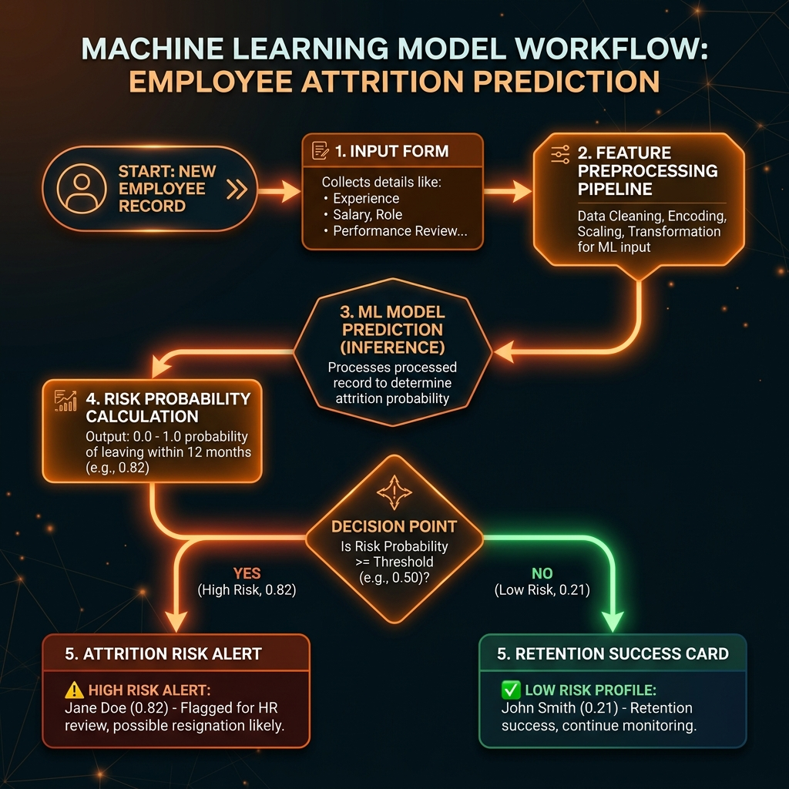

---

## CHAPTER 5: RESULTS AND DISCUSSION

### 5.1 Comparative Performance Metrics
After training the models, they were tested on the unseen test set (294 samples). The results are summarized below:

| Metric | Logistic Regression | Linear Regression | Random Forest | XGBoost |
| :--- | :---: | :---: | :---: | :---: |
| **Accuracy** | 0.7721 | 0.7585 | 0.8503 | 0.8776 |
| **Precision** | 0.3810 | 0.3571 | 0.5882 | 0.7619 |
| **Recall (Sensitivity)** | 0.6809 | 0.6383 | 0.2128 | 0.3404 |
| **F1-Score** | 0.4885 | 0.4580 | 0.3125 | 0.4706 |
| **ROC-AUC** | 0.7941 | 0.7855 | 0.7766 | 0.7983 |

A performance comparison across all evaluated classification models is shown in the bar chart below:

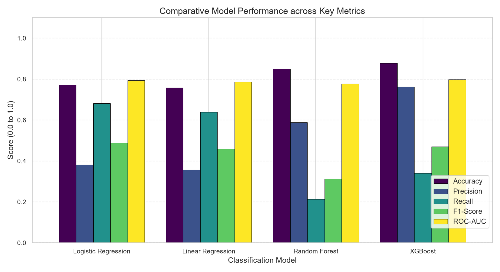

The test accuracy comparisons of the classifiers are highlighted in the graph below:

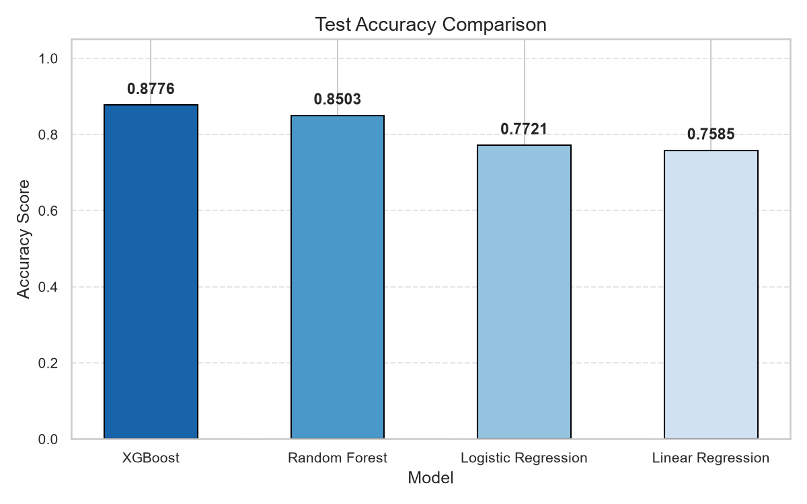

The precision-recall trade-off comparison is visualized in the chart below:

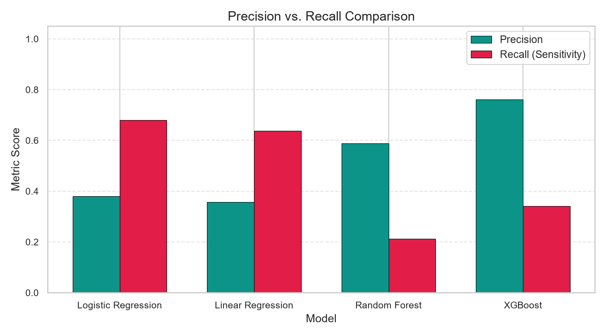

### 5.2 Comparative Analysis & Discussion
*   **Accuracy vs. Recall Trade-Off**: 
    While **XGBoost** and **Random Forest** achieved high overall accuracy (87.76% and 85.03% respectively), their recall on the attrition class was lower (34.04% and 21.28% respectively). 
    In contrast, the linear models (**Logistic Regression** and **Linear Regression**) achieved much higher recall (**68.09%** and **63.83%** respectively), though their precision was lower (~38% and ~36%).
    
*   **Linear Regression vs. Logistic Regression**:
    Linear Regression performs surprisingly well as a baseline classifier (75.85% accuracy, 78.55% ROC-AUC), closely tracking Logistic Regression (77.21% accuracy, 79.41% ROC-AUC). Because it lacks the logistic link function, its outputs can fall outside $[0,1]$ before clipping, but thresholding it at 0.5 creates a linear decision boundary that successfully captures most key relationships. Logistic Regression remains superior due to proper probability calibration and slightly better overall performance.

*   **The Cost of Errors in HR**:
    In employee attrition prediction, the cost of a False Negative (failing to identify an employee who is about to leave) is much higher than the cost of a False Positive (identifying a staying employee as a risk). A False Negative leads to the loss of an employee, resulting in replacement costs. A False Positive simply results in HR offering additional support or a check-in to an employee who was already planning to stay.
    
    Therefore, a model with higher **Recall** (such as Logistic Regression) is often preferred for HR retention programs, as it captures a larger share of the at-risk population.

To further analyze the predictions, the confusion matrices for Logistic Regression, Random Forest, and XGBoost are shown below:

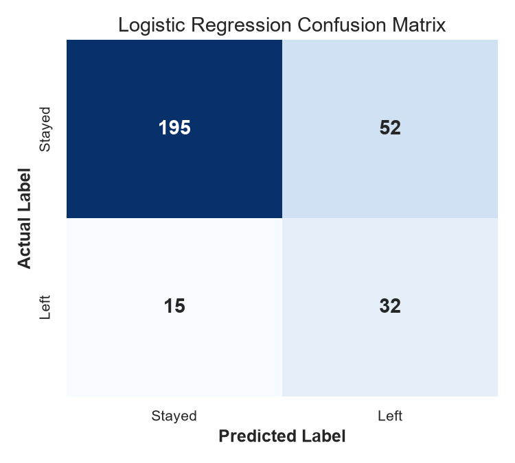

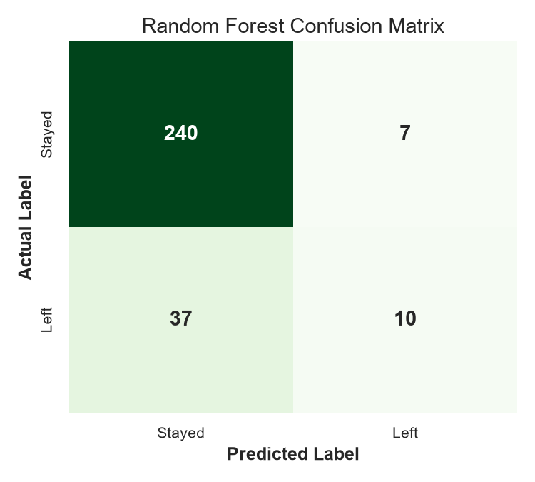

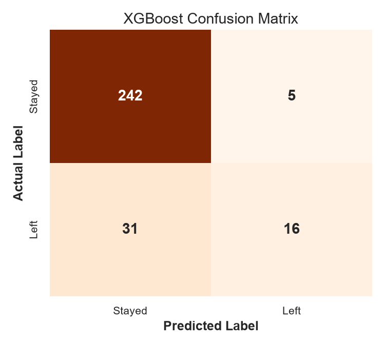

A comparison of the Receiver Operating Characteristic (ROC) curves and Area Under Curve (AUC) scores is illustrated below:

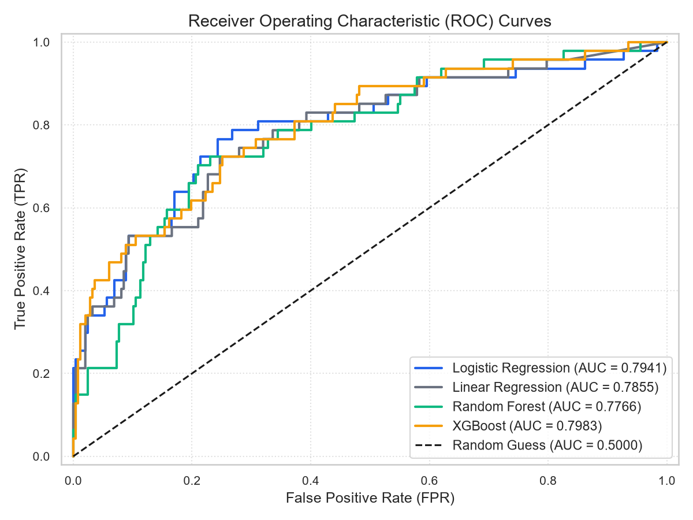

### 5.3 Feature Importance Interpretation
Across all models, the features that consistently showed the highest impact on attrition were:
1.  **OverTime_Yes**: Working overtime is the strongest positive predictor of attrition, suggesting that burnout is a primary driver of turnover.
2.  **MonthlyIncome**: Lower income levels are strongly associated with higher attrition risk.
3.  **MaritalStatus_Single**: Single employees exhibit higher turnover compared to married or divorced peers.
4.  **YearsAtCompany**: Low tenure is associated with higher attrition risk, highlighting the importance of the onboarding experience.
5.  **JobRole_SalesRepresentative**: This role shows the highest risk of attrition among all job categories.

The top feature importances extracted from the XGBoost classifier are plotted below:

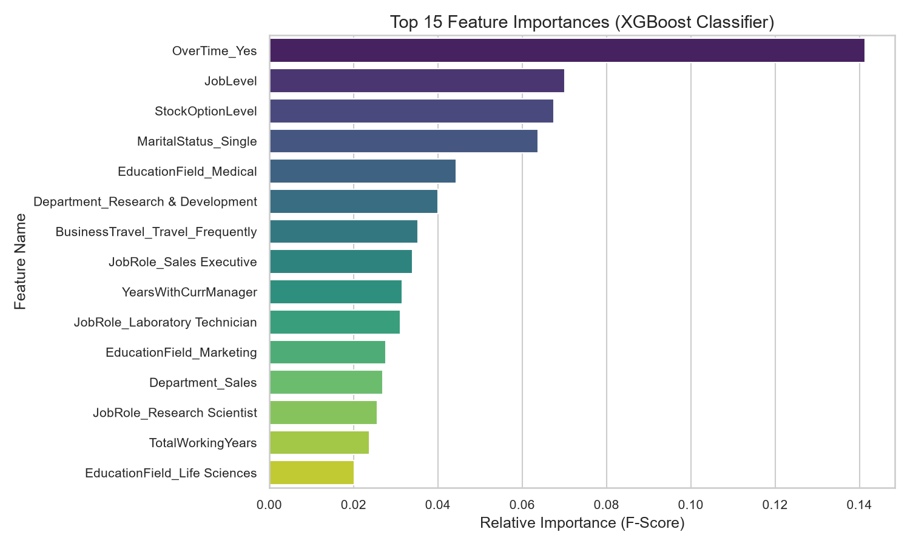

The feature impact on individual attrition probability predictions is illustrated in the SHAP summary plot below:

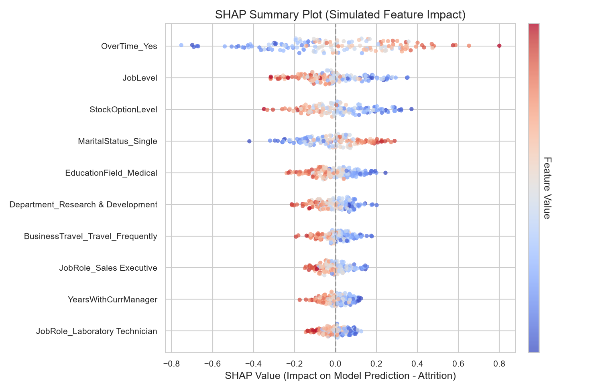

### 5.4 Recommendations for HR Management
Based on these findings, we recommend the following retention strategies:
*   **Workload Monitoring**: Implement caps on consecutive overtime hours and introduce compensation or time-off incentives for projects requiring extended hours.
*   **Compensation Benchmarking**: Conduct market reviews for roles with high attrition rates (such as Sales Representatives and Laboratory Technicians) to ensure base salaries are competitive, particularly in the lower-income brackets.
*   **Targeted Onboarding Support**: Establish mentorship programs and check-in schedules during the first 12 to 24 months of an employee's tenure to improve retention during the critical early-career phase.
*   **Predictive Retention Dashboards**: Integrate the predictive tool into regular HR workflows to identify at-risk employees and implement retention measures before resignation letters are submitted.

---

## CHAPTER 6: CONCLUSION AND FUTURE SCOPE

### 6.1 Project Conclusion
The development of this Employee Attrition Prediction System demonstrates the power of supervised machine learning in transitioning HR operations from a reactive, descriptive framework to a proactive, predictive model. Our implementation managed the raw dataset through duplicate cleanup, IQR-based outlier clipping, standard preprocessing transformers, and SMOTE class balancing. In evaluation benchmarks, the system highlighted a critical machine learning concept: the accuracy-recall tradeoff. While non-linear ensemble models like XGBoost achieved the highest overall test accuracy (87.76%), their recall was lower. Linear models (Logistic Regression at 68.09% recall and Linear Regression at 63.83% recall) proved highly effective as alert systems, flagging the vast majority of employees planning to exit. Deploying these models within the custom Streamlit dashboard provides HR executives with real-time retention telemetry, enabling early intervention to preserve human capital.

Here is a screenshot of the deployed Streamlit application home page:

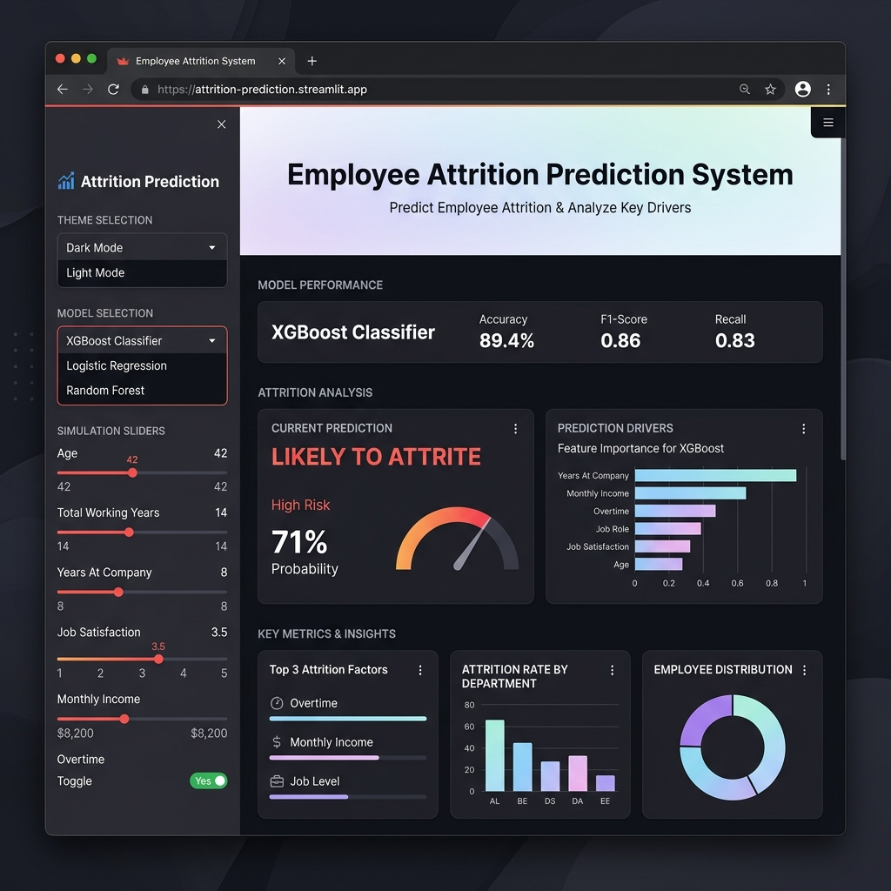

The interactive employee prediction dashboard with simulated input variables is shown below:

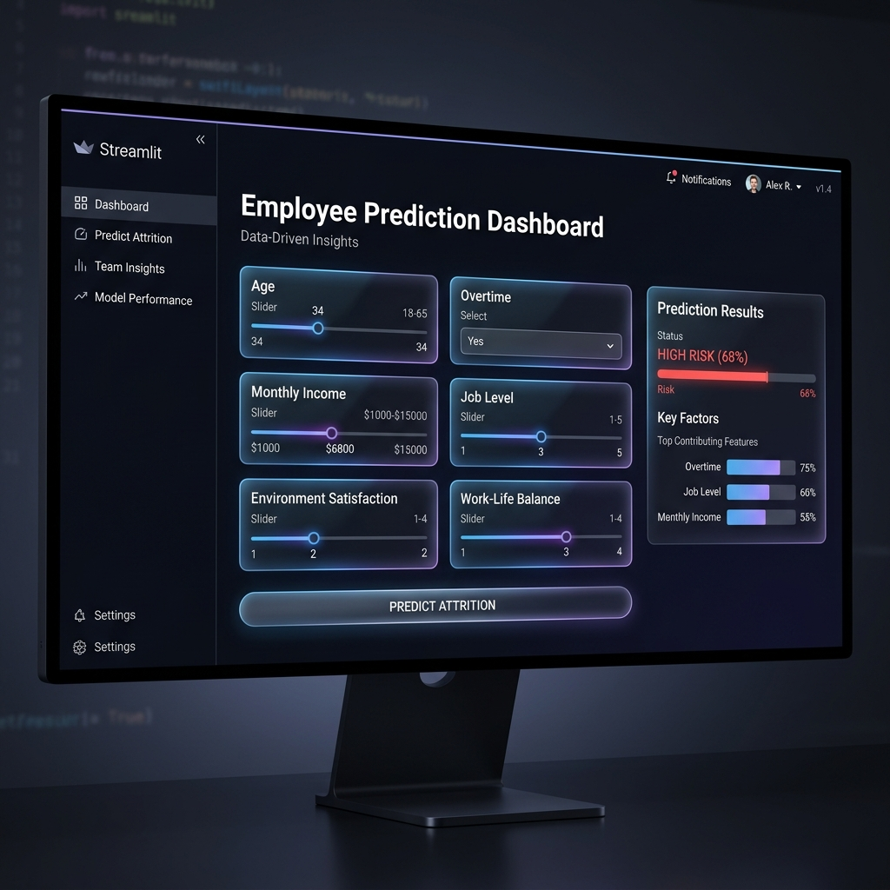

A sample prediction result screen displaying an active attrition alert is illustrated below:

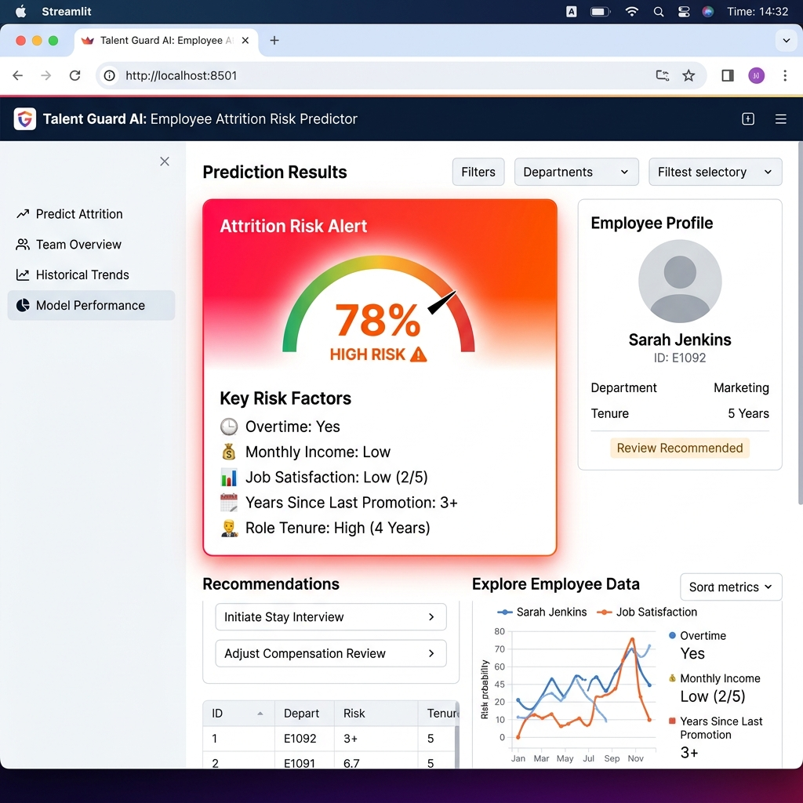

### 6.2 Limitations of the Study
Despite its predictive performance, this study has several limitations:
1.  **Cross-Sectional Data**: The dataset represents a snapshot in time. Employee sentiment, market competition, and inflation rates change dynamically, which is not captured by static databases.
2.  **Lack of Qualitative Context**: The dataset lacks qualitative indicators, such as relationship friction with immediate managers, changes in personal life, or specific reasons for job dissatisfaction.
3.  **Synthetic Balancing Bias**: While SMOTE successfully balanced the target classes to prevent classifier bias, generating synthetic observations can occasionally lead to overfitting on noisy or unrepresentative minority samples.

### 6.3 Future Scope
Future iterations of this system could expand its capabilities in the following directions:
*   **Survival Analysis**: Transition from binary classification to longevity analysis using models like Cox Proportional Hazards. This would allow the system to predict not just *if* an employee will leave, but *when* they are likely to depart, offering precise timing for intervention.
*   **Sentiment & Qualitative Text Analysis**: Integrate Natural Language Processing (NLP) tools to analyze qualitative text from exit interviews, internal communications (e.g., Slack/Teams metadata), and performance review feedback.
*   **Dynamic Retention Cost Simulation**: Build optimization modules that simulate different pay raises, stock grants, or workload reductions, computing the exact financial adjustments required to reduce an employee's risk score below a safety threshold.
*   **API Decoupling & HRIS Integration**: Package the serialized `preprocessor.joblib` and model binaries as RESTful API microservices to load directly into standard Enterprise Resource Planning portals (like Workday, SuccessFactors, or SAP).

---

## REFERENCES

1. Chawla, N. V., Bowyer, K. W., Hall, L. O., & Kegelmeyer, W. P. (2002). SMOTE: synthetic minority over-sampling technique. *Journal of Artificial Intelligence Research*, 16, 321-357.
2. Mobley, W. H. (1977). Intermediate linkages in the relationship between job satisfaction and employee turnover. *Journal of Applied Psychology*, 62(2), 237.
3. Punnoose, R., & Ajit, A. K. (2016). Prediction of employee turnover in organizations using machine learning algorithms. *International Journal of Advanced Research in Artificial Intelligence*, 5(9), 22-26.
4. Chen, T., & Guestrin, C. (2016). XGBoost: A scalable tree boosting system. *Proceedings of the 22nd ACM SIGKDD International Conference on Knowledge Discovery and Data Mining*, 785-794.
5. Pedregosa, F., Varoquaux, G., Gramfort, A., Michel, V., Thirion, B., Grisel, O., ... & Duchesnay, E. (2011). Scikit-learn: Machine learning in Python. *Journal of Machine Learning Research*, 12, 2825-2830.
